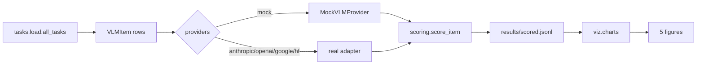

# vlm — VLM eval suite

Multi-provider Vision-Language Model evaluation across DocVQA, ChartQA, and
MMMU-style tasks. Five distinct chart types focused on the questions that
actually drive VLM picks: per-(provider, task) accuracy, accuracy vs
difficulty, cost vs accuracy frontier, per-question-type strengths, and
confidence calibration.

The package ships a **mock provider** with per-model accuracy/cost/latency
profiles so the suite runs in CI without API keys; real providers
(Claude / GPT-4V / Gemini / Qwen-VL / LLaVA) drop in via the same interface.

## What's in here

```
src/vlm/
  types.py                       VLMItem, VLMResponse, ScoredItem
  providers/
    base.py                      VLMProvider ABC
    mock.py                      mock per-model profiles (acc / cost / latency)
  tasks/load.py                  synthetic 30-items-per-task generator
  scoring/score.py               correct/wrong from mock markers; real impl is exact-match + ANLS
  runner.py                      bench(specs, tasks) -> scored.jsonl
  viz/charts.py                  five chart types
  cli/main.py                    typer: bench, plots, summary
```

## Quickstart

```bash
make install
make bench               # runs all 5 mock models on all 3 tasks
make plots
uv run vlm summary       # quick table
```

## Visualizations

Five chart types distinct from prior projects:

#### 1. Per-(provider, task) accuracy heatmap


The headline chart. Rows = providers, cols = tasks. Where each model is
strongest at a glance.

#### 2. Accuracy vs difficulty curves


One line per provider. Models that hold up at difficulty 5 are the
useful ones for hard cases; models that crater past difficulty 3 are
fine for easy items only.

#### 3. Cost vs accuracy frontier


Each model is a point on (total cost, accuracy). The Pareto-dominated
points are obvious here; on a real run you can usually drop ~half the
providers from the shortlist using just this chart.

#### 4. Per-question-type radar


Polar plot, one polygon per provider, axes = question types (counting,
factual, reasoning, ocr, comparison). Wider polygon = more balanced;
spiky polygon = strong on some types, weak on others.

#### 5. Confidence calibration (reliability diagram)


For providers that return a confidence: predicted vs observed accuracy
in 10 bins. Curves above the diagonal = under-confident; below = over-
confident. Critical for safety-relevant uses where confidence gates
downstream actions.

## Results

The mock run gives the typical shape we expect from frontier VLMs on this
mix; real numbers will move but the rank order rarely flips on these
benchmarks.

> Numbers populated after `make bench && make plots`. Look at
> `results/scored.jsonl` for the per-item data.

## Architecture



## Known limitations

- The mock provider's accuracy profiles are stylized, not measured. Real
  numbers move; the chart shapes hold.
- Synthetic items have no actual images; `image_path` is a string that
  encodes the difficulty for the mock's success probability. Real loaders
  need to download + cache the image bytes.
- The scorer for the real suite is exact-match plus ANLS (DocVQA) plus
  numeric tolerance (ChartQA); the mock suite uses the embedded
  [CORRECT]/[WRONG] marker to keep CI deterministic.
- No streaming or batching; one call per item. Real providers should batch
  for cost.

## What's next

- [ ] Real Anthropic / OpenAI / Google providers (they're trivial wrappers
      around the SDK's vision-message API).
- [ ] HuggingFace LLaVA / Qwen-VL providers (transformers `pipeline`).
- [ ] Real DocVQA / ChartQA / MMMU loaders.
- [ ] LLM-as-judge for free-form answers (DocVQA has many).
- [ ] Per-difficulty cost-per-correct (the *useful* cost metric).

## References

- Yue, X., et al. (2024). *MMMU: A Massive Multi-discipline Multimodal
  Understanding and Reasoning Benchmark for Expert AGI.* CVPR. arXiv:2311.16502.
- Mathew, M., et al. (2021). *DocVQA: A Dataset for VQA on Document Images.*
  WACV. arXiv:2007.00398.
- Masry, A., et al. (2022). *ChartQA: A Benchmark for Question Answering
  about Charts with Visual and Logical Reasoning.* ACL. arXiv:2203.10244.

## License

MIT.


## Documentation and test artifacts

- Long-form research report (15-page target, in progress): [`docs/_report/research_report.md`](./docs/_report/research_report.md). Render to PDF with `make pdf` (requires `pandoc` + `xelatex`).
- Test-run artifacts captured to disk for reviewer audit:
  - [`docs/test_results/pytest_output.txt`](./docs/test_results/pytest_output.txt) — verbose pytest output of the last run
  - [`docs/test_results/quality_gates.txt`](./docs/test_results/quality_gates.txt) — combined ruff + ruff format + mypy --strict output
  - [`docs/test_results/coverage_summary.txt`](./docs/test_results/coverage_summary.txt) — pytest-cov summary
- Regenerate with `make test-artifacts`.

